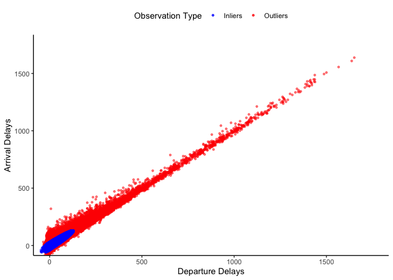
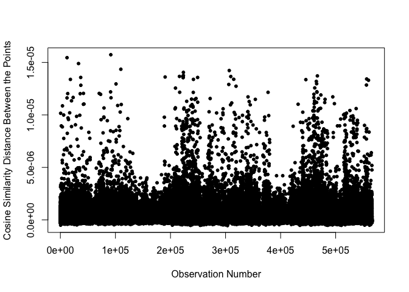

Outlier and Anomaly Detection
================
Sasha Gryshchenko
January 4, 2022

## Data Exploration

We begin with loading the data and exploring the patterns seen in the
variables. First, we wish to understand what the variables are and infer
whether we’ll be needing them for the future analyses.

``` r
flights <- read.csv("~/Documents/GitHub/DataAnalysis-Sasha-Ced/Flights1_2019_1.csv")
summary(flights)
```

    ##       YEAR       DAY_OF_WEEK      FL_DATE          ORIGIN_AIRPORT_ID
    ##  Min.   :2019   Min.   :1.000   Length:583985      Min.   :10135    
    ##  1st Qu.:2019   1st Qu.:2.000   Class :character   1st Qu.:11292    
    ##  Median :2019   Median :4.000   Mode  :character   Median :12889    
    ##  Mean   :2019   Mean   :3.836                      Mean   :12660    
    ##  3rd Qu.:2019   3rd Qu.:5.000                      3rd Qu.:13931    
    ##  Max.   :2019   Max.   :7.000                      Max.   :16218    
    ##                                                                     
    ##  ORIGIN_AIRPORT_SEQ_ID ORIGIN_CITY_MARKET_ID ORIGIN_CITY_NAME   DEST_AIRPORT_ID
    ##  Min.   :1013505       Min.   :30070         Length:583985      Min.   :10135  
    ##  1st Qu.:1129202       1st Qu.:30721         Class :character   1st Qu.:11292  
    ##  Median :1288903       Median :31453         Mode  :character   Median :12889  
    ##  Mean   :1265974       Mean   :31753                            Mean   :12659  
    ##  3rd Qu.:1393102       3rd Qu.:32467                            3rd Qu.:13931  
    ##  Max.   :1621802       Max.   :35991                            Max.   :16218  
    ##                                                                                
    ##  DEST_AIRPORT_SEQ_ID DEST_CITY_MARKET_ID DEST_CITY_NAME     DEST_STATE_ABR    
    ##  Min.   :1013505     Min.   :30070       Length:583985      Length:583985     
    ##  1st Qu.:1129202     1st Qu.:30721       Class :character   Class :character  
    ##  Median :1288903     Median :31453       Mode  :character   Mode  :character  
    ##  Mean   :1265951     Mean   :31753                                            
    ##  3rd Qu.:1393102     3rd Qu.:32467                                            
    ##  Max.   :1621802     Max.   :35991                                            
    ##                                                                               
    ##    DEP_DELAY           ARR_TIME       ARR_DELAY        ARR_DELAY_NEW    
    ##  Min.   : -47.000   Min.   :   1    Min.   : -85.000   Min.   :   0.00  
    ##  1st Qu.:  -6.000   1st Qu.:1104    1st Qu.: -16.000   1st Qu.:   0.00  
    ##  Median :  -3.000   Median :1517    Median :  -7.000   Median :   0.00  
    ##  Mean   :   9.766   Mean   :1484    Mean   :   4.258   Mean   :  13.65  
    ##  3rd Qu.:   5.000   3rd Qu.:1919    3rd Qu.:   7.000   3rd Qu.:   7.00  
    ##  Max.   :1651.000   Max.   :2400    Max.   :1638.000   Max.   :1638.00  
    ##  NA's   :16355      NA's   :17061   NA's   :18022      NA's   :18022    
    ##    ARR_DEL15        X          
    ##  Min.   :0.000   Mode:logical  
    ##  1st Qu.:0.000   NA's:583985   
    ##  Median :0.000                 
    ##  Mean   :0.186                 
    ##  3rd Qu.:0.000                 
    ##  Max.   :1.000                 
    ##  NA's   :18022

Looks like there are a lot of variable roughly describing the same
things - like those relating to location (airport IDs and city names),
so we won’t be needing both types. Furthermore, there are “corrected”
versions of the arrival times - we will keep the original delays (the
“new” arrival delay seems to have replaced negative values with zeroes)
and arr\_del15 - it may come in handy later. The section below further
explands on the decisions made to keep/drop certain variables.

## Data Dictionary

<table class="table" style="font-size: 10px; margin-left: auto; margin-right: auto;">
<caption style="font-size: initial !important;">
Flights, or RITA (Reporting Carrier On-Time Performance), Data
Dictionary
</caption>
<thead>
<tr>
<th style="text-align:left;font-weight: bold;">
Name
</th>
<th style="text-align:left;font-weight: bold;">
Definition
</th>
<th style="text-align:center;font-weight: bold;">
Data Type
</th>
<th style="text-align:left;font-weight: bold;">
Domain
</th>
<th style="text-align:center;font-weight: bold;">
Required
</th>
</tr>
</thead>
<tbody>
<tr>
<td style="text-align:left;font-style: italic;">
YEAR
</td>
<td style="text-align:left;width: 4cm; ">
year of flight
</td>
<td style="text-align:center;">
numeric
</td>
<td style="text-align:left;width: 4cm; ">
{2019}
</td>
<td style="text-align:center;">
no
</td>
</tr>
<tr>
<td style="text-align:left;font-style: italic;">
DAY\_OF\_WEEK
</td>
<td style="text-align:left;width: 4cm; ">
day of week for the flight
</td>
<td style="text-align:center;">
numeric
</td>
<td style="text-align:left;width: 4cm; ">
\[1, 7\]
</td>
<td style="text-align:center;">
yes
</td>
</tr>
<tr>
<td style="text-align:left;font-style: italic;">
FL\_DATE
</td>
<td style="text-align:left;width: 4cm; ">
date of flight
</td>
<td style="text-align:center;">
character
</td>
<td style="text-align:left;width: 4cm; ">
\[2019-01-01, 2019-01-31\]
</td>
<td style="text-align:center;">
yes
</td>
</tr>
<tr>
<td style="text-align:left;font-style: italic;">
ORIGIN\_AIRPORT\_ID
</td>
<td style="text-align:left;width: 4cm; ">
airport ID at the origin
</td>
<td style="text-align:center;">
numeric
</td>
<td style="text-align:left;width: 4cm; ">
\[10,135, 16,218\]
</td>
<td style="text-align:center;">
no
</td>
</tr>
<tr>
<td style="text-align:left;font-style: italic;">
ORIGIN\_AIRPORT\_SEQ\_ID
</td>
<td style="text-align:left;width: 4cm; ">
airport ID at the origin (at the sequential level)
</td>
<td style="text-align:center;">
numeric
</td>
<td style="text-align:left;width: 4cm; ">
\[1,013,505, 1,621,802\]
</td>
<td style="text-align:center;">
no
</td>
</tr>
<tr>
<td style="text-align:left;font-style: italic;">
ORIGIN\_CITY\_MARKET\_ID
</td>
<td style="text-align:left;width: 4cm; ">
identification number assigned to identify a city market at the origin
</td>
<td style="text-align:center;">
numeric
</td>
<td style="text-align:left;width: 4cm; ">
\[30,070, 35,991\]
</td>
<td style="text-align:center;">
no
</td>
</tr>
<tr>
<td style="text-align:left;font-style: italic;">
ORIGIN\_CITY\_NAME
</td>
<td style="text-align:left;width: 4cm; ">
US city and state name at the origin
</td>
<td style="text-align:center;">
character
</td>
<td style="text-align:left;width: 4cm; ">
\*340 unique cities
</td>
<td style="text-align:center;">
yes
</td>
</tr>
<tr>
<td style="text-align:left;font-style: italic;">
DEST\_AIRPORT\_ID
</td>
<td style="text-align:left;width: 4cm; ">
airport ID at the destination
</td>
<td style="text-align:center;">
numeric
</td>
<td style="text-align:left;width: 4cm; ">
\[10,135, 16,218\]
</td>
<td style="text-align:center;">
no
</td>
</tr>
<tr>
<td style="text-align:left;font-style: italic;">
DEST\_AIRPORT\_SEQ\_ID
</td>
<td style="text-align:left;width: 4cm; ">
airport ID at the destination (at the sequential level)
</td>
<td style="text-align:center;">
numeric
</td>
<td style="text-align:left;width: 4cm; ">
\[1,013,505, 1,621,802\]
</td>
<td style="text-align:center;">
no
</td>
</tr>
<tr>
<td style="text-align:left;font-style: italic;">
DEST\_CITY\_MARKET\_ID
</td>
<td style="text-align:left;width: 4cm; ">
identification number assigned to identify a city market at the
destination
</td>
<td style="text-align:center;">
numeric
</td>
<td style="text-align:left;width: 4cm; ">
\[30,070, 35,991\]
</td>
<td style="text-align:center;">
no
</td>
</tr>
<tr>
<td style="text-align:left;font-style: italic;">
DEST\_CITY\_NAME
</td>
<td style="text-align:left;width: 4cm; ">
US city and state name at the destination
</td>
<td style="text-align:center;">
character
</td>
<td style="text-align:left;width: 4cm; ">
\*340 unique cities
</td>
<td style="text-align:center;">
yes
</td>
</tr>
<tr>
<td style="text-align:left;font-style: italic;">
DEST\_STATE\_ABR
</td>
<td style="text-align:left;width: 4cm; ">
abbreviated name of state at the destination
</td>
<td style="text-align:center;">
character
</td>
<td style="text-align:left;width: 4cm; ">
\*52 unique names
</td>
<td style="text-align:center;">
yes
</td>
</tr>
<tr>
<td style="text-align:left;font-style: italic;">
DEP\_DELAY
</td>
<td style="text-align:left;width: 4cm; ">
delay of departure in minutes
</td>
<td style="text-align:center;">
numeric
</td>
<td style="text-align:left;width: 4cm; ">
\[-47, 1,651\]
</td>
<td style="text-align:center;">
yes
</td>
</tr>
<tr>
<td style="text-align:left;font-style: italic;">
ARR\_TIME
</td>
<td style="text-align:left;width: 4cm; ">
time of arrival
</td>
<td style="text-align:center;">
numeric
</td>
<td style="text-align:left;width: 4cm; ">
\[1, 2,400\]
</td>
<td style="text-align:center;">
no
</td>
</tr>
<tr>
<td style="text-align:left;font-style: italic;">
ARR\_DELAY
</td>
<td style="text-align:left;width: 4cm; ">
delay of arrival in minutes
</td>
<td style="text-align:center;">
numeric
</td>
<td style="text-align:left;width: 4cm; ">
\[-85, 1,638\]
</td>
<td style="text-align:center;">
yes
</td>
</tr>
<tr>
<td style="text-align:left;font-style: italic;">
ARR\_DELAY\_NEW
</td>
<td style="text-align:left;width: 4cm; ">
adjusted delay of arrival in minutes
</td>
<td style="text-align:center;">
numeric
</td>
<td style="text-align:left;width: 4cm; ">
\[0, 1,638\]
</td>
<td style="text-align:center;">
yes
</td>
</tr>
<tr>
<td style="text-align:left;font-style: italic;">
ARR\_DEL15
</td>
<td style="text-align:left;width: 4cm; ">
unknown
</td>
<td style="text-align:center;">
numeric
</td>
<td style="text-align:left;width: 4cm; ">
{0, 1}
</td>
<td style="text-align:center;">
yes
</td>
</tr>
<tr>
<td style="text-align:left;font-style: italic;">
X
</td>
<td style="text-align:left;width: 4cm; ">
unknown
</td>
<td style="text-align:center;">
uknown
</td>
<td style="text-align:left;width: 4cm; ">
none
</td>
<td style="text-align:center;">
no
</td>
</tr>
</tbody>
</table>

For the variables **origin\_city\_name** and **dest\_city\_name**, we
can separate the state name after the city name into its own variable.
Also, we will drop variables that we previously stated were considered
to be unlikely to contribute to the outlier detection.

We can visualize how many flights occurred on any given day, of which
there were 31 (the month of January in 2019), and see if there are any
visible differences in the data. We see that the majority of the number
of flights were above 18,000, with 5 observations below that threshold.
With the boxplot, we see that there are three outliers (using Tukey’s
boxplot test). These occur on the 12th, 19th, and 26th of the month.

<div class="figure" style="text-align: center">


<p class="caption">
Number of Flights Exploration: Month
</p>

</div>

Some of the destination cities include two city names - presumably
because the persons travelling are flying to an airport closest to their
actual destination (perhaps there isn’t an airport at the final
destination). For those cases, we will only keep the name of the city
that has an airport for simplicity. This may have some drawbacks -
airports located on the edge of the state may cause some confusion
(e.g., Dulles airport is located in Virginia, but people often arrive
there when travelling to Washington, D.C.) or mislabeling the actual
destination. We will carry on with the changes as we want to see the
name of the city, rather than the location of the airport.

We can now study the number of flights on any particular day of the
week.

## Data Exploration

<div class="figure" style="text-align: center">


<p class="caption">
Number of Flights Exploration: Weekdays
</p>

</div>

Assuming that 1 corresponds to a Monday (we checked that January 1, 2019
is a Tuesday and corresponds to a 2 in the data), we notice that the
number of flights is lower on day 6, which is a Saturday, than it is on
the rest of the days of the week.

In the boxplot, we actually see that there are no outliers - so perhaps
it is the case that less people fly to and from the cities in the
dataset on a Saturday. This may or may not be true, but we will leave
this matter alone for now and explore the rest of the data.

Next, we can take a look at how many flights departed from each city to
notice if there are any blank spaces with very few odd flights or if
they are spread across the country.

``` r
originflight <- aggregate(flights$VALUE, by=list(flights$ORIGIN_STATE_ABR,flights$ORIGIN_CITY_NAME), sum)
colnames(originflight) <- c("state","city","FlightNum")

destflight <- aggregate(flights$VALUE, by=list(flights$DEST_STATE_ABR,flights$DEST_CITY_NAME), sum)
colnames(destflight) <- c("state","city","FlightNum")
```

``` r
uscities <- read.csv("~/Documents/GitHub/DataAnalysis-Sasha-Ced/uscities.csv")
originlatlon <- merge(x=subset(uscities,select=c("city","state_name","lat","lng","state_id")),y=originflight,
      by.x=c("city","state_id"),by.y=c("city","state"))
```

<div class="figure" style="text-align: center">


<p class="caption">
Number of Flights by City: Departures
</p>

</div>

In using the maps to help us understand the data, we notice that the
origin/destination include Puerto Rico (the actual island outline is not
shown on either map) as well as parts of the USA. For the origin of
flights, we see that the majority depart from the East Coast, as well as
a lot of departures from CA, TX, and CO.

``` r
destlatlon <- merge(x=subset(uscities,select=c("city","state_name","lat","lng","state_id")),y=destflight,
      by.x=c("city","state_id"),by.y=c("city","state"))
```

<div class="figure" style="text-align: center">


<p class="caption">
Number of Flights by City: Arrivals
</p>

</div>

We see a similar result for the flight destination cities. There isn’t
any one state where the number of flights is less than 8. That, combined
with the boxplot we looked at earlier, suggests that there may not be an
outlier/anomaly in terms of an origin/destination of a flight. We will
have to study this further, but we will move on for now.

We can now take a look at the relationship between departure and arrival
delays. We would expect this relationship to be roughly linear, since if
a flight departs 10 minutes late, it is likely to arrive 10 minutes late
as well. However, there are conditions under which this will not be
true. E.g., good weather will allow for a shorter flight, while bad
weather can delay it; sometimes planes have to wait on the tarmac for
their spot to open up even after the plane landed; any other unexpected
situations.

<div class="figure" style="text-align: center">


<p class="caption">
Departure vs Arrival Delays
</p>

</div>

While 18,022 observations are not included in this plot (these are
missing observations and they make up about 3.1% of the observations),
it is still abundantly clear that the relationship between the delay in
flight departure and arrival is practically linear. There are, however
some interesting patterns worth mentioning.

While majority of the data are concentrated near the left bottom corner
(low values), there are quite a few observations exceeding these small
delays, even going into over a day delay (1,651 minutes = 27 hours and
31 minutes). It is plausible that some flights did indeed get delayed
for over a day in a few cases, especially given that it’s January and a
lot of the flights originated at/arrived to the east coast, where the
weather conditions could be quite poor.

Further notice that in our earlier analyses, we saw that 3rd quartile
for departure delays was 5 minutes and for arrival delays, it was 7
minutes. Thus, it is suggestive that the long delays are potentially
outliers that can be explained by some other factors and not anomalies
(as we see a lot of these).

Another interesting observation is that the arrival delays sometimes
exceed departure delays (e.g., 231 minutes vs. 89 minutes). As we
mentioned earlier, there are explainable reasons for why that may
happen, so these values are conceivable. Also note that a lot of the
values for both variables are negative, suggesting that the flights
departed/arrived earlier than the scheduled time.

We can further analyse the departure and arrival delays, as compared to
the day of the week.

<div class="figure" style="text-align: center">


<p class="caption">
Departure Delays by Day of the Week
</p>

</div>

As we noted before, majority of departure delays are relatively short
(with mean of about 10 minutes), but there are quite a few flights with
delays of several hours. We see that for every day of the week there are
flights with departure delays lasting over a day, but the most
noticeable extreme delays fall on a Friday - there are three extreme
delays that stand out the most. We will have to investigate that later.

<div class="figure" style="text-align: center">


<p class="caption">
Departure Delays by Date
</p>

</div>

Similar to the finding for the days of the week, we see that there are a
few extreme observations that fall on specific dates. Namely, there are
two observations that really stand out - the extreme delay on the 5th
and the 25th - these are relatively extreme to the rest of the data.
While these are the most “extreme” relative to the data, it does not
mean that the other numbers we are seeing are not extreme - delays of
over a few hours are questionable regardless of the day of the week/time
if the month.

These results will be very similar for the delay in arrivals, so those
are not presented again.

Another variable that’s worth analyzing to better understand the long
delays is **arr\_del15**. We suspect that this is an indicator variable
equaling 1 when a flight is delayed for over 15 minutes or 0 otherwise.

<div class="figure" style="text-align: center">


<p class="caption">
15+ Minute Arrival Delays Exploration
</p>

</div>

We see that only a relatively small fraction of flights was delayed for
over 15 minutes (only \~18% of all flights, which matches with the data
on arrival delays). We can take a look at how these delays are spread
out throughout the month of January. Also above we see that there are
not any obvious extreme discrepancies in the delay patterns - the
fraction of flights that arrive over 15 minutes late hovers around the
average for every day if the month.

We also want to consider arrival delay of less than -15 minutes, i.e.,
those flights that arrived over 15 minutes early.

<div class="figure" style="text-align: center">


<p class="caption">
15+ Minute Arrival Delays vs Arrival Delays
</p>

</div>

We can also see from the density plot above that there is a visible
difference between the two groups for the variable **arr\_del15**. The
mean for the non-delayed group for the arrival delay is around - 10
minutes (i.e., early arrivals) and for the delayed group it’s 68 minutes
(i.e., over an hour delay). This may be beneficial in deciding what the
outliers are - instead of using the entire dataset, we may be able to
break the data down by this indicator and detect outliers that way.

``` r
summary(flights$ARR_DELAY[which(flights$ARR_DEL15==1)])
```

    ##    Min. 1st Qu.  Median    Mean 3rd Qu.    Max. 
    ##   -85.0   -23.0   -17.0    12.7    29.0  1638.0

We see that by only considering the data where the delays are over 15
minutes, the quantiles have shifted, potentially helping us identify the
“true” outliers. This may be the case because the negative values skew
the data, where the negative values are simply early arrivals. Arrival
delays lasting more than 15 minutes are already outliers on their own -
presumably that’s why the variable was created. So, we will use this
variable to identify which arrival delays spanned for over 15 minutes
and see how these compare to the outliers found by other methods.

## Data Analysis: Departure vs Arrival Delays

### HDBSCAN

<div class="figure" style="text-align: center">


<p class="caption">
Clusters for Full Data (Sample)
</p>

</div>

Above is the plot for the results of HDBSCAN for the entire dataset. The
black points are the outliers (as identified by the method). Note that
here we only used a sample from the data due to the dataset dimensions -
there are far too many observations for the package to run, so we will
need to come up with a method to sample over the data and observe what’s
identified as an “outlier”.

``` r
n <- 100
z <- indz <- vector(mode="list", length=n)
hdbscanResult <- vector(mode="list", length=n)
for (i in 1:n){
  z[[i]] <- numvars[sample(nrow(numvars),20000),]
  hdbscanResult[[i]] <- which(hdbscan(z[[i]],minPts=10)$cluster==0)
  indz[[i]] <- as.numeric(rownames(z[[i]][hdbscanResult[[i]],]))
}

indH <- unlist(indz)

colors <- c("Inliers" = "blue", "Outliers" = "red")
ggplot() +
  labs(x = "Day of Week", y = "Delay in Departure") +
  theme_classic() +
  geom_point(data=flights[unique(indH[duplicated(indH)]),],
             aes(x=DEP_DELAY,y=ARR_DELAY,color="red"),
             alpha=0.5,shape=20) +
  geom_point(data=flights[-unique(indH[duplicated(indH)]),],
             aes(x=DEP_DELAY,y=ARR_DELAY,color="blue"),
             alpha=0.5,shape=20) +
  theme(legend.position = "top", legend.direction = "horizontal") +
  scale_color_identity(name = "Observation Type",
                          breaks = c("blue", "red"),
                          labels = c("Inliers", "Outliers"),
                          guide = "legend") + 
  coord_cartesian(xlim = c(0, 1750), ylim = c(0, 1750))
```

<div class="figure" style="text-align: center">


<p class="caption">
HDBSCAN: Clusters for Full Data
</p>

</div>

Rather than plotting all the different clusters the method created, we
focus on only outliers vs. non-outliers. It is evident that there are
quite a few observations identified as outliers (all the red points),
but these are actually a small fraction of the dataset (relative to how
it looks in the plot above) - (or 24.7%) of the observations are
outliers. We see that the inliers are centered around the small positive
and negative values, with most of the outliers scattered around larger
delay times.

### Mahalanobis Distance

We can use a distance based method to group those observations that are
similar (as we did before, but only now we’ll focus on creating one
group). A good start here would be mahalanobis - we will look for the
distances between observations, select a reasonable cut off distance,
and see how this compares to the previous results.

<div class="figure" style="text-align: center">


<p class="caption">
Mahalanobis Distance
</p>

</div>

It seems that the majority of the distances between points and the
calculated data center are quite small - mostly below \~200. We can
begin by selecting a cut-off distance equivalent to the 99th percentile.
In this case, this is 22.7 and there are 5,660 observations that are
greater than the aforementioned value. We can plot these observations as
outliers (in red) vs the rest of the data or inliers (in blue).

<div class="figure" style="text-align: center">


<p class="caption">
Mahalanobis Distance: 99th Percentile
</p>

</div>

This is quite similar to what we found previously (and what we expected
to see) - those observations that have shorter delay times are
considered inliers, while those exceeding a pre-specified threshold are
outliers (or, potentialy, anomalies). It is also clear that those
obsrvations where the delays in departures vs arrivals are not
consistent (e.g., 3 vs 73 minutes) are thought of as outliers.

Next, we can try to increase this threshold and see how the pattern
changes for the inliers. We now present a plot for the delay data where
99.9% of the data are inliers (based on the calculated distances) and so
566 observations are potential outliers.

<div class="figure" style="text-align: center">


<p class="caption">
Mahalanobis Distance: 99.9th Percentile
</p>

</div>

It becomes evident that whatever observations are close to the
calculated center (9 minutes for departure and 4 minutes for arrival
delays) will be regarded as the inliers. We conclude that it makes more
sense to use the 99th percentile as a frame of reference.

### Cosine Similarity Distance

Next, we can use the cosine similarity distance and see how this
compares to previous results. We do so by calculating the similarity
between the data points and the data center - simply the means for each
departure and arrival delays. We again plot the distances and see that
the majority are concentrated around zero. We will again choose the 99th
percentile (distance of 6.7) as the distance cutoff and treat all values
above this as outliers. There are 5,660 of these.

<div class="figure" style="text-align: center">


<p class="caption">
Cosine Similarity Distance
</p>

</div>

<div class="figure" style="text-align: center">


<p class="caption">
Cosine Similarity Distance: 99th Percentile
</p>

</div>

Again we see a similar pattern to that found when using the Mahalanobis
distance. Note that out of 5,660 identified outliers by both methods,
4,114 (or 72.7%) overlap - this gives us some confidence in there
observations being true outliers. We will compare the results for all
methods later and make conclusions about anamolous data points.

``` r
length(intersect(which(d>as.numeric(quantile(d,0.99))),which(mdist>as.numeric(quantile(mdist,0.99)))))
```

    ## [1] 4114

### Isolation Forest Method

Next, we can move onto density based methods, starting out with
Isolation Forest Method (IsoForest). This technique tries to isolate
anomalous points by randomly selecting an attribute and a split value
between that attribute’s min/max values, continuing until every point is
alone in its component. Below we see that in using this method there are
quite a few points in the scatterplot where their score lies far from
\~0, which is the dense region. Similarly, in the density plot we note
the long tail, likely containing outlying observations. Results here are
shown for one tree, build in a specific way, but we would like to
observe the results of using many trees to validate the presence of
outliers.

<div class="figure" style="text-align: center">


<p class="caption">
Isolation Forest Distance
</p>

</div>

We can proceed with creating 2,220 trees with various parameters,
identifying the outliers for each, and then comparing these to each
other. The result is the outliers that repeatedly show up in each tree.

``` r
pars <- list("sample_size"=c(seq(256,565760,2560),565963),
             "ntrees"=seq(10,100,10))
iso.den <- matrix(rep(list(vector(mode="list")),length(pars[[1]])*length(pars[[2]])),
                  nrow=length(pars[[1]]),ncol=length(pars[[2]])) 
for (i in 1:length(pars[[1]])){
  for (j in 1:length(pars[[2]])){
    iso.den[[i,j]] <- which(predict(isolation.forest(numvars,sample_size=pars[[1]][i],
                        ntrees=pars[[2]][j],ndim=1,nthreads=1),numvars)>
                        quantile(predict(isolation.forest(numvars,sample_size=pars[[1]][i],
                        ntrees=pars[[2]][j],ndim=1,nthreads=1),numvars),0.99))
  }
}
isoF <- unique(unlist(iso.den)[duplicated(unlist(iso.den))])
```

Below is the plot with the outlying and inlying observations. Once
again, this is consistent with what we saw for the distance-based
methods.

<div class="figure" style="text-align: center">


<p class="caption">
IsoForest: 99th Percentile
</p>

</div>

### Local Outlier Factor

We can proceed with LOF (local outlier factor). This methods works by
calculating the deviations from an observation to its nearest neighbors.
An observation is then considered an outlier/anomaly if this deviation
is large. There are 3,115 identified by the combination of methods.

``` r
manh.dist <- function(x,y){
  d <- matrix(nrow=length(x),ncol=length(y))
  for (i in 1:(length(x))){
    for (j in 1:length(y)){
      d[i,j] <- abs(x[i]-x[j])+abs(y[i]-y[j])
    }
  }
  d
}
methodLOF <- function(number){
  s <- sample(nrow(numvars),number)
  mat <- numvars[s,]
  mat <- scale(mat,center=TRUE,scale=TRUE)
  k <- floor(sqrt(dim(mat)[1]))
  mdist <- manh.dist(mat[,1],mat[,2])
  kdist <- t(apply(mdist,1,order))[,seq(2,1+k,1)]

  rd <- matrix(nrow=dim(kdist)[1],ncol=dim(kdist)[2])
  for (i in 1:(dim(kdist)[1])){
    for (j in 1:(dim(kdist)[2])){
     rd[i,j] <- max(mdist[i,kdist[i,j]],mdist[kdist[i,j],kdist[kdist[i,j],k]])
   }
  }
  lrd <- c()
  for (i in 1:dim(kdist)[1]){
    lrd[i] <- k/sum(rd[i,])
  }

  lof <- c()
  for (i in 1:dim(kdist)[1]){
    lof[i] <- sum(lrd[kdist[i,]])/(k*lrd[i])
  }
  
  as.numeric(s[which(lof>quantile(lof,0.99))])
}
lofs <- replicate(500,methodLOF(5000))
lofs <- unlist(lofs)[duplicated(unlist(lofs))]
```

Below is the plot of inliers vs outliers.

<div class="figure" style="text-align: center">


<p class="caption">
LOF: 99th Percentile
</p>

</div>

## Final Results

We can compare the results of all methods. We won’t display each outlier
as there are too many here; instead, we will display how many outliers
each method identified.

<table class="table" style="font-size: 10px; margin-left: auto; margin-right: auto;">
<caption style="font-size: initial !important;">
Outliers for Each Method
</caption>
<thead>
<tr>
<th style="text-align:left;font-weight: bold;">
</th>
<th style="text-align:center;font-weight: bold;">
15+ Minute Delay (Data)
</th>
<th style="text-align:center;font-weight: bold;">
HDBSCAN
</th>
<th style="text-align:center;font-weight: bold;">
Mahalanobis Distance
</th>
<th style="text-align:center;font-weight: bold;">
Cosine Similarity Distance
</th>
<th style="text-align:center;font-weight: bold;">
Isolation Forest
</th>
<th style="text-align:center;font-weight: bold;">
LOF
</th>
</tr>
</thead>
<tbody>
<tr>
<td style="text-align:left;">
Number of Outliers
</td>
<td style="text-align:center;">
269143
</td>
<td style="text-align:center;">
91593
</td>
<td style="text-align:center;">
5660
</td>
<td style="text-align:center;">
5660
</td>
<td style="text-align:center;">
17619
</td>
<td style="text-align:center;">
17367
</td>
</tr>
</tbody>
</table>

Next, we will find what outliers overlap for each method and plot these
against the inliers. This set will be our final set of outliers.

<div class="figure" style="text-align: center">


<p class="caption">
Outliers for Flight’s Data
</p>

</div>
